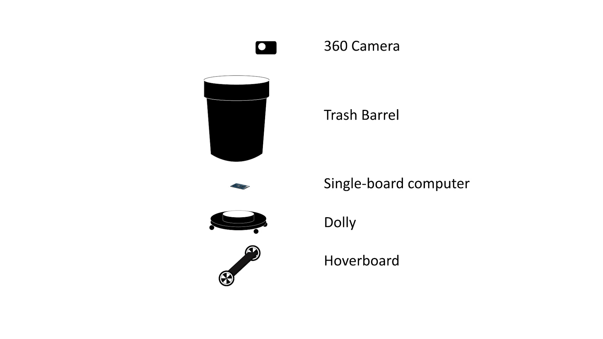

## Social Signaling in Urban Public Human-Robot Interaction dataset

### Abstract 
This paper presents a dataset capturing human-robot interactions (HRI) in urban public settings. The data were gathered by deploying two mobile trash barrel robots in public plazas in New York City. The dataset includes social signals that can be analyzed to gain insights into naturalistic HRI. Currently, the dataset consists of around ***25*** hours of video footage recorded from the robots' perspectives, along with over ***800*** annotated interactions. To our knowledge, this is the first dataset showcasing robot deployments in complete public, non-controlled settings involving urban residents.

### Dataset Overview

***Data Format:*** 360 video and audio recorded from the robots' perspective

***Deployment Location:***
- [Astor Place](https://www.nyc.gov/site/cecm/permitting/astor-place-plaza.page)  (Manhattan, New York City)
  - The robots were deployed at Astor Place in the summer of 2022. The deployment occurred over five days, with each session lasting from one to two hours in the early afternoon.
  - Deployment dates: Sep 21, Sep 26, Sep 28, Oct 6th, Oct 12th (2022)
- [Albee Square](https://www.nyc.gov/site/cecm/permitting/albee-square.page) (Brooklyn, New York City)
  - The robots were deployed at Albee Square in the summer of 2023. Similar to Astor Place, the robots were also deployed for five days, one to two hours each day. 
  - Deployment dates: July 6th, July 7th, July 11th, July 12th, July 14th (2023)
- More to come...

### Samples

<!--  -->

### Recording Devices
To capture the social signals around them, each trash barrel robot is equipped with [Insta360 One R camera](https://www.insta360.com/product/insta360-oner_twin-edition) with built-in microphones. The robots are powered by recycled hoverboards; the robust metal chassis provides the structural integrity needed to navigate outdoor urban terrain. Computationally, each robot runs on a Raspberry Pi 4 running the Ubuntu 20.04 server and Robot Operating System (ROS 1 Noetic).

### How to get access?
We are happy to share the data with interaction researchers. To request access:
1. Obtain IRB approval (or equivalent) from your home institution for secondary data usage (Data Usage Policy can be found [here](./SSUP-HRI%20Data%20Use%20Agreement.pdf)).
2. Sign and return the [Data Usage Agreement](./SSUP-HRI%20Data%20Use%20Agreement.pdf) to Frank (fb266@cornell.edu).

### Related Publications
1. Brown, Barry, et al. "Trash in Motion: Emergent Interactions with a Robotic Trashcan." Proceedings of the CHI Conference on Human Factors in Computing Systems. 2024. [Link](https://dl.acm.org/doi/full/10.1145/3613904.3642610)
2. Bu, Fanjun, et al. "Field Notes on Deploying Research Robots in Public Spaces." Extended Abstracts of the CHI Conference on Human Factors in Computing Systems. 2024. [Link](https://dl.acm.org/doi/full/10.1145/3613905.3651044)
3. Bu, Fanjun, et al. "Trash barrel robots in the city." Companion of the 2023 ACM/IEEE International Conference on Human-Robot Interaction. 2023. [Link](https://dl.acm.org/doi/abs/10.1145/3568294.3580206)

Maintainer: Fanjun Bu (fb266@cornell.edu)
